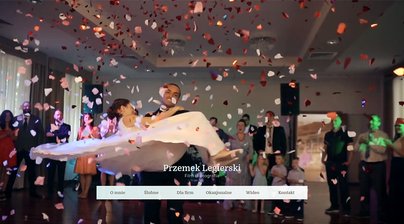

# PrzemekLegierski.pl - Portfolio Website
> Portfolio page for photographer and filmmaker Przemysław Legierski.

## Table of contents
* [General info](#general-info)
* [Screenshots](#screenshots)
* [Technologies](#technologies)
* [Setup](#setup)
* [Status](#status)
* [Contact](#contact)

## General info
A project for a client who wanted a website with an easy content management system. My design and wordpress template written from scratch. There is CMS WordPress with ACF and CPT. The ability to replace texts on the home page (frontpage) and edit photos and videos.

## Screenshots

## Technologies
* WordPress, ACF, CPT
* HTML5, CSS, SASS (flexbox)
* JavaScript ES6+
* Babel, Gulp

## Setup
* Code only for review.

## Status
Project is: _finished_

## Contact
Created by [@grzegorzboczek](https://grzegorzboczek.pl/) - feel free to contact me!